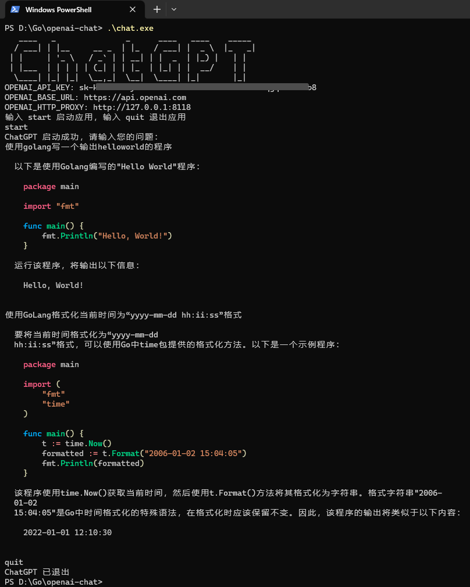

# OpenAI-Chat

使用 Go 语言实现命令行版 ChatGPT 应用

## 构建

```
shell> go mod tidy
shell> go build ./chat.go
```

## 环境变量

| 名称 | 是否必需 | 默认值 | 备注 |
| ------------ | ------------ | ------------ | ------------ |
| OPENAI_API_KEY | 是 |  | OpenAI 账户的 API KEY |
| OPENAI_BASE_URL | 否 | https://api.openai.com | OpenAI 账户的 API URL |
| OPENAI_HTTP_PROXY | 否 |  | HTTP 代理 |

## 使用示例

启动这个应用，如果没有设置 OPENAI_API_KEY 系统环境变量，会提示你设置

```PowerShell
shell> ./chat.exe
请设置 OPENAI_API_KEY 环境变量
    Bash (Linux or macOS): export OPENAI_API_KEY="XXXXXX"
    PowerShell (Windows): $env:OPENAI_API_KEY="XXXXXX"
#
# 备注：把 XXXXXX 替换为自己 OpenAI 账户的 API KEY
shell> $env:OPENAI_API_KEY="XXXXXX"
```

可选的，可以设置已实现“科学上网”的镜像地址
 - 假定 `https://ai.example.com` 是 `https://api.openai.com` 的镜像地址
 - Bash (Linux or macOS): `export OPENAI_BASE_URL="https://ai.example.com"`
 - PowerShell (Windows): `$env:OPENAI_BASE_URL="https://ai.example.com"`

可选的，可以设置已实现“科学上网”的 HTTP 代理
 - Bash (Linux or macOS): `export OPENAI_HTTP_PROXY="http://127.0.0.1:8118"`
 - PowerShell (Windows): `$env:OPENAI_HTTP_PROXY="http://127.0.0.1:8118"`

示例


